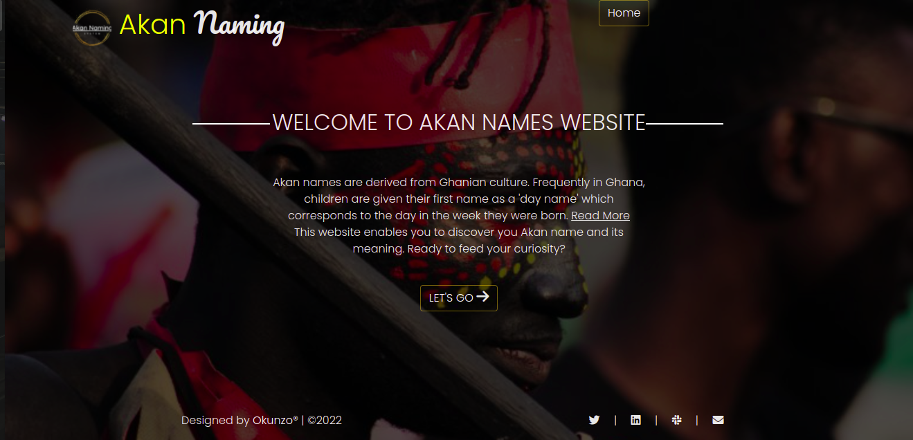

# Akan Naming System
#### By Charles Okunzo
### This website refers to Ghanian akan naming system

## Table of Contents
+ [Description](#description)
+ [Installation Requirements](#installation)
+ [Live link](#link)
+ [Technologies Used](#technology)
+ [Reference](#reference)
+ [Lisence](#lisence)
+ [Authors Info](#author)

## Description

This website refers the Ghanaian naming system where people were named according to the day of the week they were born based on their gender. You can check your Akan name as well through the link provided.

## Installation 
### Requirements

* Either a computer,phone,tablet or an Ipad
* An access to the Internet
### Installation
* Clone the github repo
* Open the clone in a text editor and host it on your browser

[Go Back to the top](#portfolio)

## Live link
[Follow This Link](https://charles-okunzo.github.io/Akan-Naming-System_IP2)

## Technology Used
* HTML- to build the structure of the page
* CSS- to style the the pages
* Javascript- to enable interractivity with the page.

[Go Back to the top](#portfolio)

## Reference
* Materialize CSS

## Licence

copyright (c) 2022 MIT License. [View License Here](LICENSE)

[Go Back to the top](#portfolio)

## Authors Info

* Slack Profile - [Charles Okunzo](https://app.slack.com/client/T0101L740P4/C010GLANY3A/user_profile/U02TTFQ0VJR)
* Email address - [Charles Okunzo](charles.okunzo@student.moringaschool.com)

